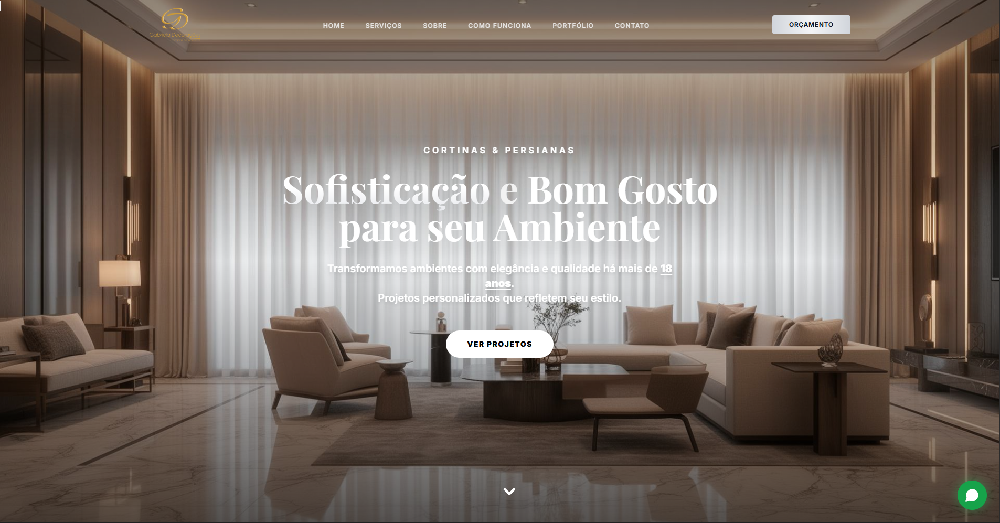

<div align="center">

<a href="https://git.io/typing-svg">
  
</a>

<br/>

<a href="https://robsondev.vercel.app"></a>
<a href="https://www.linkedin.com/in/robson-rodrigues-dev/"></a>
<a href="https://discord.com/users/409017051223556121"></a>


</div>

---

## 🧠 Sobre mim


Sou desenvolvedor **Full Stack** focado em criar **produtos digitais completos** — do front-end moderno e animado até back-end seguro, pagamentos, autenticação e painéis administrativos.

Gosto de projeto que **sai do papel e vai pro ar**: site de cliente real, sistema com usuário de verdade, deploy, métrica e manutenção.

- 🔭 Trabalhando agora em **sites para clientes** e no **Simula SISU 2026** (simulador de notas de corte)
- 🎓 **Análise e Desenvolvimento de Sistemas — IFG**
- 🧩 Interesse em **arquitetura, segurança e performance**
- 📍 **Brasília, DF** — aberto a projetos remotos
- ⚡ Montei meu primeiro PC aos 12 e nunca mais parei

<br clear="right"/>

```ts
const robson = {
  role: "Full Stack Developer",
  location: "Brasília, DF 🇧🇷",
  frontend: ["Next.js", "React", "TypeScript", "Tailwind", "Framer Motion"],
  backend: ["Node.js", "Express", "Prisma", "Supabase", "Spring"],
  data: ["PostgreSQL", "MySQL", "MongoDB", "Redis"],
  infra: ["Docker", "Vercel", "Linux", "GitHub Actions"],
  focus: "produtos reais, rápidos e bem feitos",
};
```

---

## 🏆 Projeto em Destaque

### 🪟 Gabriela Decorações — Site Institucional

> Site **high-end** de uma empresa com **mais de 18 anos** no mercado de cortinas, persianas e decoração em Brasília. Feito para apresentar o portfólio da marca com elegância e transformar visita em orçamento pelo WhatsApp.

<div align="center">
  <a href="https://www.gabrieladecoracoes.com.br/">
    
  </a>
</div>

<br/>

<div align="center">


</div>

**✨ Destaques:**
* 🎨 **Visual premium:** hero em tela cheia, tipografia serifada e identidade alinhada à marca.
* 🖼️ **Portfólio real:** galeria com mais de 20 projetos entregues pela empresa.
* 💬 **Conversão:** CTAs de orçamento e botão flutuante direto para o WhatsApp.
* 📱 **Responsivo:** layout pensado para celular, com imagem de hero própria para mobile.
* 📊 **Métricas:** Vercel Analytics + Speed Insights para acompanhar acessos e performance.

<div align="center">

<a href="https://www.gabrieladecoracoes.com.br/"></a>
<a href="https://github.com/RobsonRodriguess/Gabriela-Decoracoes"></a>

</div>

---

## 📂 Outros Projetos

<div align="center">

<a href="https://github.com/RobsonRodriguess/portfolio-robsondev"></a>
<a href="https://github.com/RobsonRodriguess/Candangos-Shop"></a>
<a href="https://github.com/RobsonRodriguess/Mind-Health"></a>
<a href="https://github.com/RobsonRodriguess/BloxMarket"></a>

</div>

| Projeto | O que é | Stack |
|---|---|---|
| 🌐 **[Portfólio RobsonDev](https://robsondev.vercel.app)** | Meu portfólio com i18n PT/EN, tema claro/escuro e Spotify *Now Playing* em tempo real | Next.js 16 · React 19 · Tailwind v4 · Framer Motion |
| 🛒 **[Candangos Shop](https://github.com/RobsonRodriguess/Candangos-Shop)** | E-commerce para comunidade de jogos com Pix automático, login via Discord e painel admin | React · Supabase (RLS) · Edge Functions |
| 🧠 **[Mind Health](https://github.com/RobsonRodriguess/Mind-Health)** | TCC sobre saúde mental | — |
| 🎓 **Simula SISU 2026** *(privado)* | Simulador de notas de corte do SISU em monorepo | Next.js · Express · Prisma · PostgreSQL · Docker |

---

## 🧬 Tecnologias

<div align="center">

### 🔥 Linguagens


### 🌐 Front-end


### 🧠 Back-end & Dados

<br/>


### ☁️ Infra & DevOps


</div>

---

## 📊 GitHub Stats

<div align="center">


</div>

---

## 🌐 Contato

<div align="center">

<a href="https://robsondev.vercel.app"></a>&nbsp;
<a href="https://www.linkedin.com/in/robson-rodrigues-dev/"></a>&nbsp;
<a href="https://discord.com/users/409017051223556121"></a>&nbsp;
<a href="https://github.com/RobsonRodriguess"></a>

<sub>Tem um projeto em mente? Me chama pelo <a href="https://robsondev.vercel.app">formulário do portfólio</a>. 🚀</sub>

</div>

---

<div align="center">
<picture>
  <source media="(prefers-color-scheme: dark)" srcset="https://raw.githubusercontent.com/RobsonRodriguess/RobsonRodriguess/output/github-contribution-grid-snake-dark.svg">
  <source media="(prefers-color-scheme: light)" srcset="https://raw.githubusercontent.com/RobsonRodriguess/RobsonRodriguess/output/github-contribution-grid-snake.svg">
  
</picture>
</div>


