


<a href="#sobre"></a>
<a href="#projetos"></a>
<a href="#arsenal"></a>
<a href="#placar"></a>
<a href="#contato"></a>

 



<b>📄 Ler em modo texto</b>

 

Sou desenvolvedor **Full Stack** focado em criar **produtos digitais completos**: do front-end moderno e animado até back-end seguro, pagamentos, autenticação e painéis administrativos. Gosto de projeto que **sai do papel e vai pro ar**.

- 🎓 **Análise e Desenvolvimento de Sistemas — IFG**
- 🔭 Hoje: sites para clientes e o **Simula SISU 2026**
- 🧩 Arquitetura, segurança e performance
- 📍 **Brasília, DF** — aberto a projetos remotos e freelas

 


<a href="https://www.gabrieladecoracoes.com.br/">
  
</a>

<b>📜 Detalhes da missão — Gabriela Decorações</b>

 

> Site **high-end** de uma empresa com **mais de 18 anos** no mercado de cortinas, persianas e decoração em Brasília. Feito para apresentar o portfólio da marca com elegância e transformar visita em orçamento pelo WhatsApp.

* 🎨 **Visual premium:** hero em tela cheia, tipografia serifada e identidade alinhada à marca.
* 🖼️ **Portfólio real:** galeria com mais de 20 projetos entregues pela empresa.
* 💬 **Conversão:** CTAs de orçamento e botão flutuante direto para o WhatsApp.
* 📱 **Responsivo:** layout pensado para celular, com hero próprio para mobile.
* 📊 **Métricas:** Vercel Analytics + Speed Insights para acompanhar acessos e performance.

**Stack:** React · TypeScript · Vite · Tailwind CSS · shadcn/ui · Vercel

 


  <a href="https://meu-portfolio-robsonrodrigues.vercel.app/"></a>
  <a href="https://github.com/RobsonRodriguess/Candangos-Shop"></a>
  
  <a href="https://github.com/RobsonRodriguess/aviator-clone-pro"></a>
  <a href="https://github.com/RobsonRodriguess/GunsAndDragons"></a>
  <a href="https://github.com/RobsonRodriguess/Mind-Health"></a>

 



<b>🧰 Ver arsenal completo</b>

 

**Linguagens** 

**Front-end** 

**Back-end & Dados** 
 

**Infra & DevOps** 

 


 


  <a href="https://www.linkedin.com/in/robson-rodrigues-dev/"></a>
  <a href="https://discord.com/users/409017051223556121"></a>
  <a href="https://meu-portfolio-robsonrodrigues.vercel.app/"></a>

🕹️ <b>Não clique aqui.</b>

 

Ok... você clicou. 👀  
<b>Código secreto desbloqueado:</b> <code>↑ ↑ ↓ ↓ ← → ← → B A</code>  
Fun fact: montei meu primeiro PC aos 12 anos e passava as tardes mexendo em servidor de CS 1.6. 
Foi ali que a programação virou o jogo principal. 🎮

 

<picture>
  <source media="(prefers-color-scheme: dark)" srcset="https://raw.githubusercontent.com/RobsonRodriguess/RobsonRodriguess/output/github-contribution-grid-snake-dark.svg">
  <source media="(prefers-color-scheme: light)" srcset="https://raw.githubusercontent.com/RobsonRodriguess/RobsonRodriguess/output/github-contribution-grid-snake.svg">
  
</picture>

